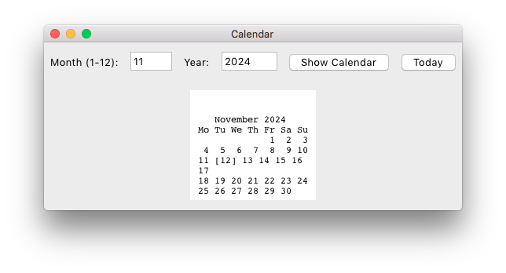

# PythonToolsGui
Some python apps TK

## Why ?

I made these apps for personal usage so I don't need to download someone else tools behind ad or paywall

I am using these apps for 10 years now, recently I've decided to share sources.

I hope you enjoy them and credit to me when contribute or using them ...

## List of Apps

- Weight Converter

- LZ4 Extractor (This app has QT version and Swift version too)

- Calendar EN

- Calendar Persian

- Password Generator
    - Has 2 mode
        - GUI
        - CLI

## LICENSE

All sources are under MIT

Thanks

## Credit

Amir Mohammad Safari (Kourosh Safari)
